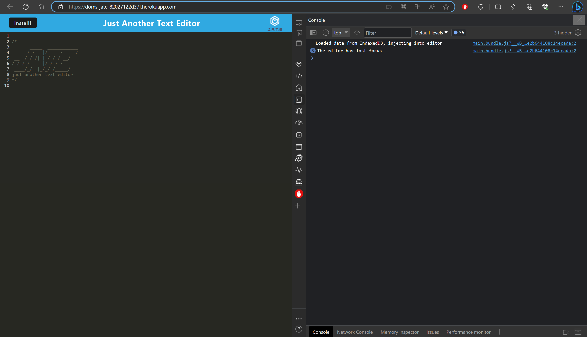
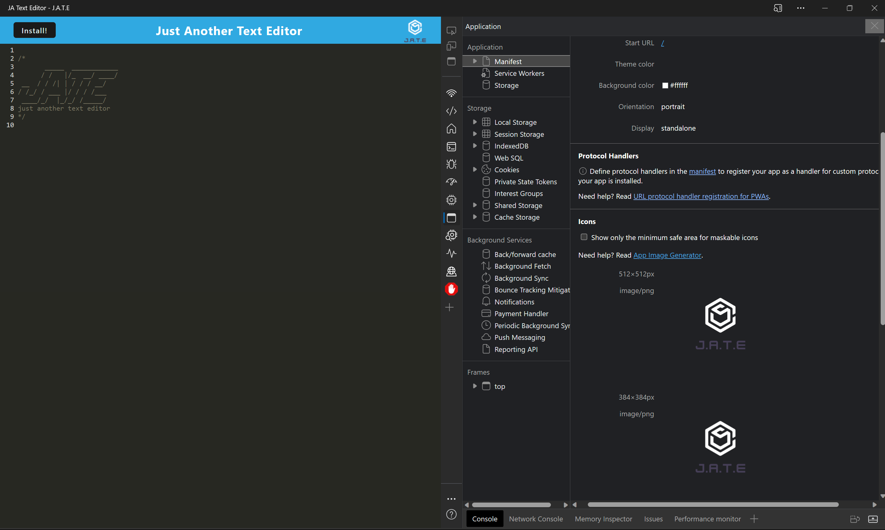

# 🌐 JATE - Just Another Text Editor  🌐


## 📚 Description
JATE (Just Another Text Editor) is a progressive web application (PWA) that provides users with a seamless text editing experience. With the power of PWA, users can install the application on their devices and use it offline. The application is designed with a modern interface and is equipped with features like auto-save, customizable themes, and more.

## 💽 Installation
To install the application on your system, follow these steps:
```bash
git clone https://github.com/Dominick-D/PWA
cd PWA
npm install
```
## 🎯 Usage

Once you've successfully installed all the required dependencies, the application is ready for use. Invoke it by running the following command:

```bash
npm run start:dev
```
Then, navigate to http://localhost:3000 in your web browser to use the application. With JATE, you can create, edit, and save your text documents with ease. The PWA capabilities ensure that you can use the application even when you're offline.
Or you may view the deployed site [Here](https://doms-jate-82027122d37f.herokuapp.com/) and do the same on the deployed application!

Deployed Site:


Downloaded App:


## 📜 License
This project is licensed under the **MIT** license.

## ❓ Questions
If you have any questions about the repo, open an issue or contact me directly at [Here](dominickdonn.me/contact). You can find more of my work on [my portfolio](domdonn.me).